> **[ ONGOING ]** — This project is actively being developed. The current version is a working demo that competed in the first round. Hardware and firmware will continue to be improved in later rounds.

---

# IoT Construction Machine Monitor

A group project built for the **"Creative Challenge 4.0"** competition hosted by the University of Transport and Technology (UTT), sponsored by lecturer Vu Duc Tuan.

The project won **Third Place**.


Note: The images below show the demo unit submitted for the first round. The product is not yet finalized.

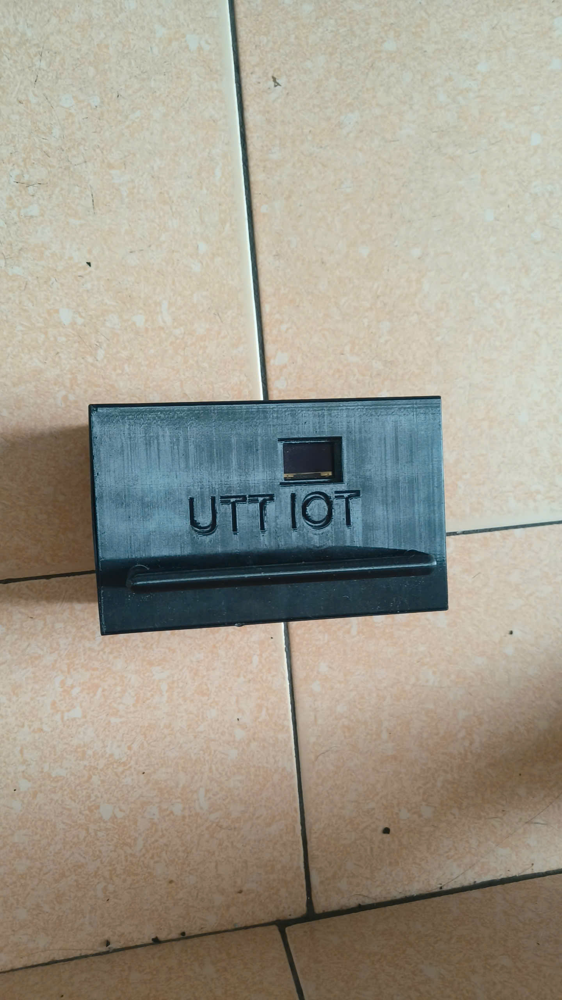 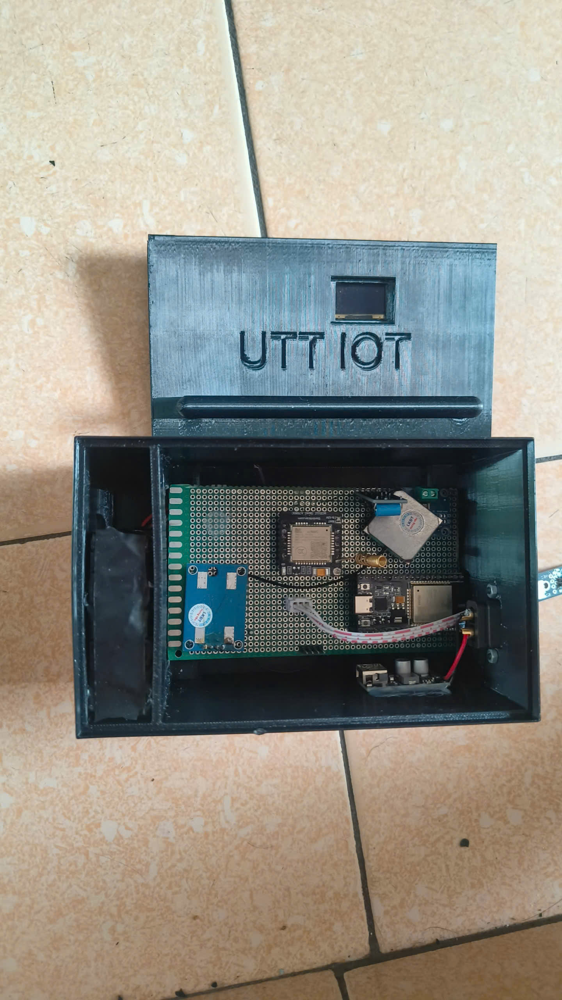

**Roles:**
- Firmware (ESP32, Arduino IDE), sensors, webserver: me
- Hardware assembly, wiring, 3D-printed enclosure: second-year team members

---

## Table of Contents

1. [System Overview](#1-system-overview)
2. [Features](#2-features)
3. [Hardware and Schematic](#3-hardware-and-schematic)
4. [Firmware](#4-firmware)
5. [Webserver — ThingsBoard on Raspberry Pi](#5-webserver--thingsboard-on-raspberry-pi)

---

## 1. System Overview

The IoT box is mounted on a construction machine to monitor it remotely. Data is sent to a ThingsBoard dashboard hosted locally on a Raspberry Pi, accessible from anywhere via ngrok.

Two identical units are supported (`iot/` for device 1, `iot_2/` for device 2), differing only in their ThingsBoard access tokens.

---

## 2. Features

### Connection Priority

The device attempts connections in this order, falling back automatically:

```
WiFi  -->  4G (SIM A7680C)  -->  AP Mode (offline)
```

- **WiFi / 4G**: sends telemetry to ThingsBoard via MQTT every 5 seconds.
- **AP Mode**: ESP32 broadcasts a hotspot named `UTT-MayThiCong` (password: `12345678`). Every 30 seconds it automatically retries the 4G connection.

### Runtime Tracking

A vibration sensor triggers a hardware interrupt (`IRAM_ATTR`) to detect whether the machine engine is on or off. The firmware accumulates `totalRunMs` and `totalIdleMs`, saving them to NVS (non-volatile storage via `Preferences`) every 1 minute so data survives power cycles.

### Idle Warning

If the engine is on (vibration detected) but the machine is not moving (GPS speed < 1 km/h), an idle warning flag is raised.

### Battery Monitoring

An INA219 sensor measures bus voltage and current. Battery percentage is calculated by interpolating a Li-Ion voltage-to-SOC lookup table (3.20 V = 0%, 4.20 V = 100%) and displayed as a bar icon on the OLED screen.

### Offline Web Dashboard (AP Mode)

When in AP Mode, the ESP32 serves a local HTML dashboard at its IP address, featuring:
- Leaflet.js map with current GPS position
- Temperature card
- Machine ON/OFF status
- Real-time updates via `/api/status` (JSON endpoint)

### Telemetry Sent to ThingsBoard (MQTT)

| Key | Description |
|---|---|
| `engine_on` | 1 if engine is running, 0 if stopped |
| `totalRunMinutes` | Accumulated engine-on time (minutes) |
| `totalIdleMinutes` | Accumulated idle time (minutes) |
| `latitude` | GPS latitude |
| `longitude` | GPS longitude |
| `temperature` | DS18B20 temperature (°C) |
| `power_mw` | Power consumption from INA219 (mW) |

---

## 3. Hardware and Schematic

The schematic uses the **"Create Sheet Symbol from Sheet"** feature (hierarchical design). All components are placed directly on the PCB — no off-the-shelf modules are used in the final design.

### Schematic Sheets

**Sheet 0 — ESP32 (main sheet)**

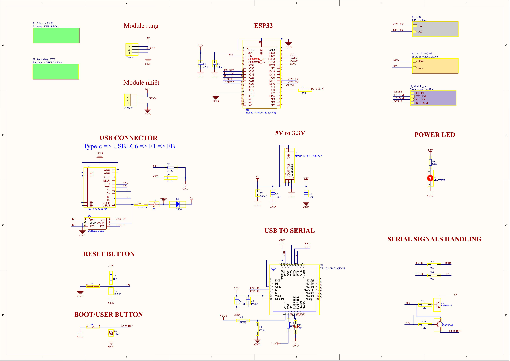

**Sheet 1 — Buck converter from lead-acid battery input**

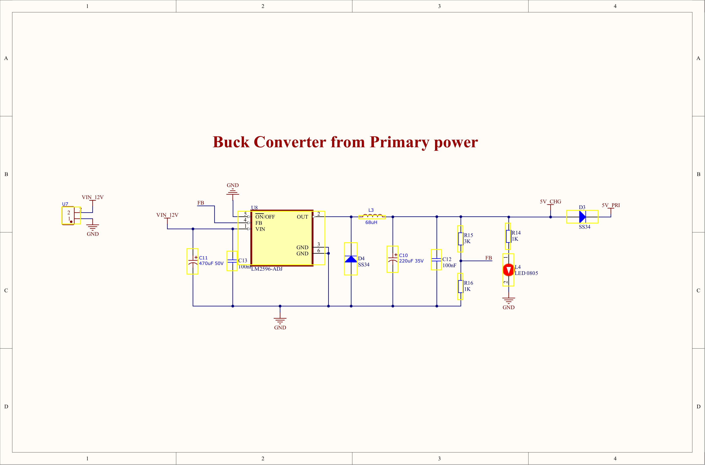

**Sheet 2 — 18650 Li-Ion charger and protection circuit**

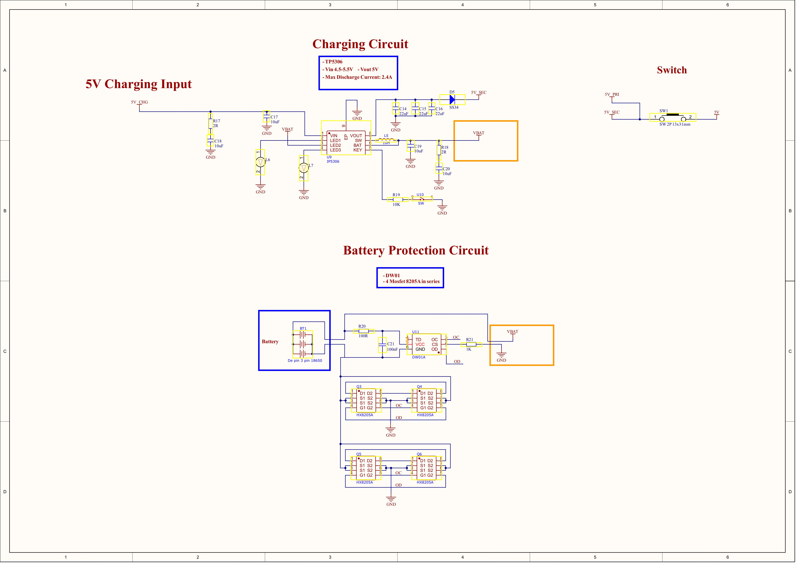

**Sheet 3 — INA219 power monitor + SSD1306 OLED display**

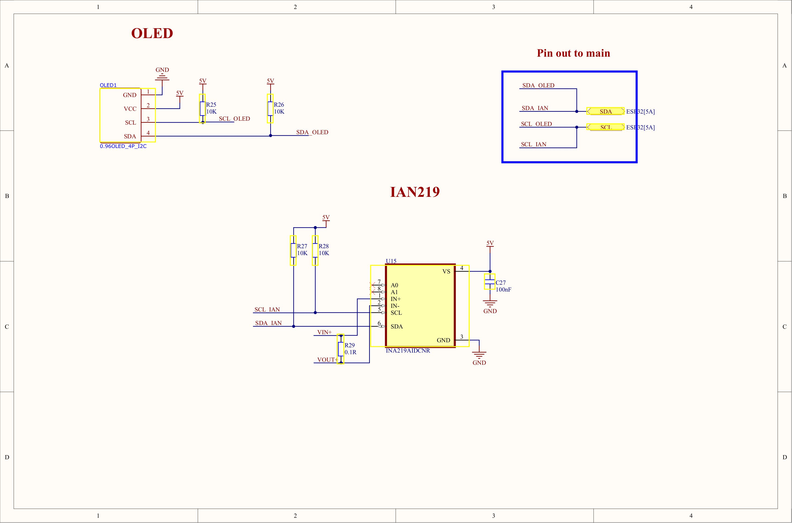

**Sheet 4 — SIM A7680C cellular module**

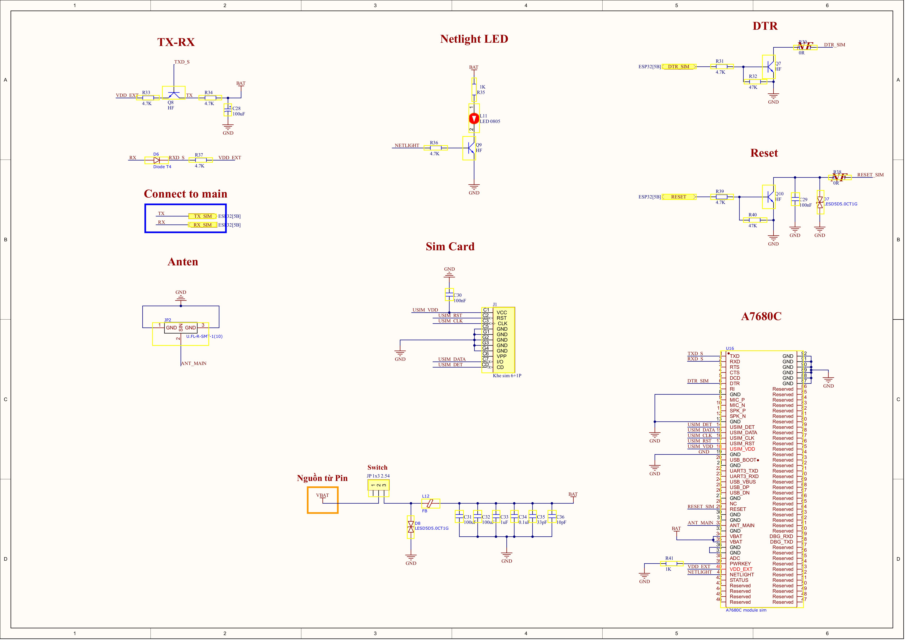

**Sheet 5 — GPS NEO-6M module**

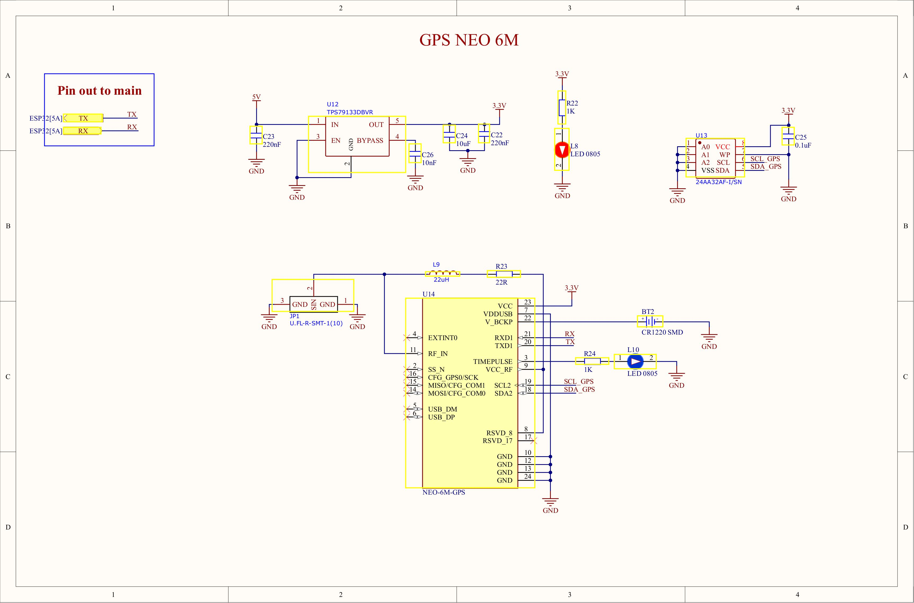

### PCB

> Note: This is a demo version. The schematic is still being revised, so the PCB has not been routed yet — components are only roughly placed.

| Front side | Back side |
|:---:|:---:|
| 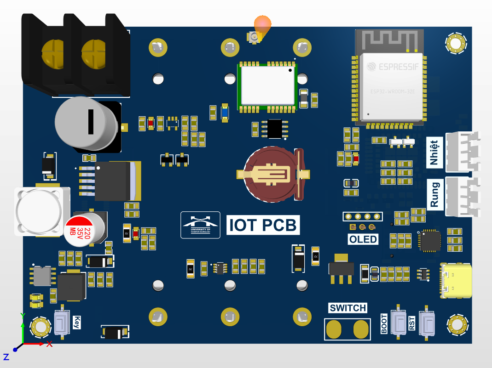 | 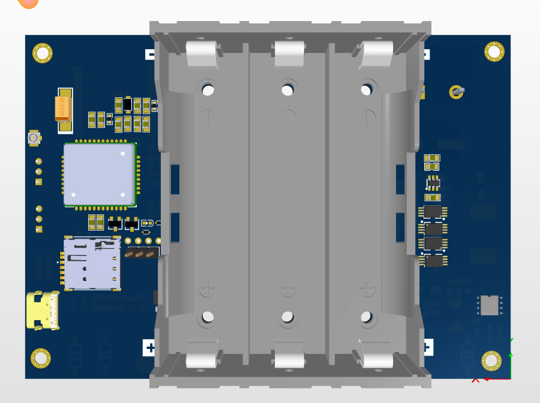 |

### Reverse Engineering the SIM and BMS Modules

Because the SIM A7680C module is a Chinese product with no publicly available schematic, I reverse-engineered it manually. I purchased a retail module, desoldered all components, then submerged the bare board in a hot NaOH solution to lift the solder mask, exposing the copper traces underneath.

The same technique was applied to the BMS protection module.

| SIM A7680C board after solder mask removal | BMS board after solder mask removal |
|:---:|:---:|
| 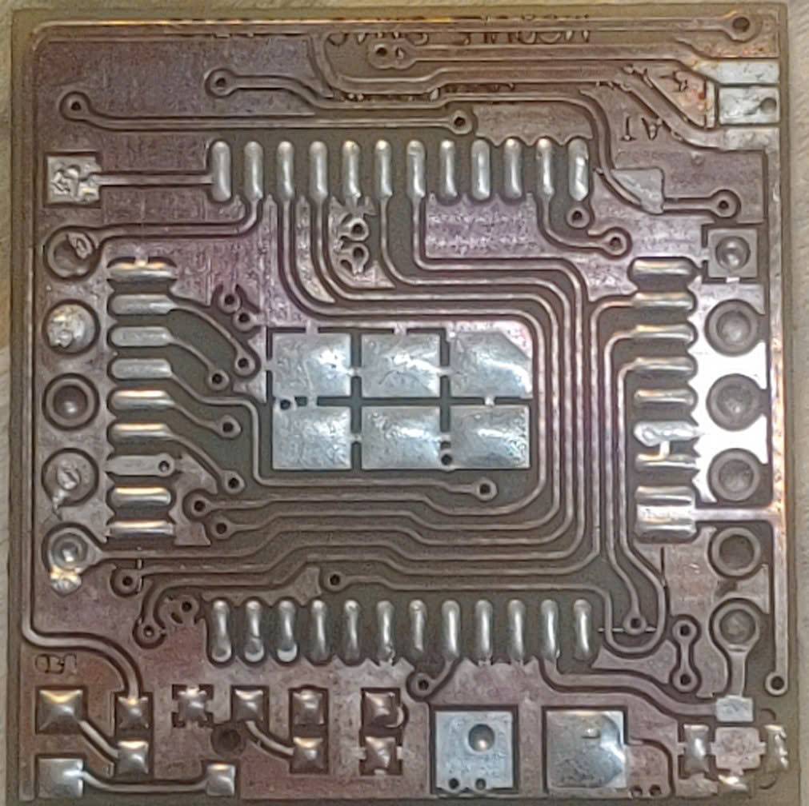 | 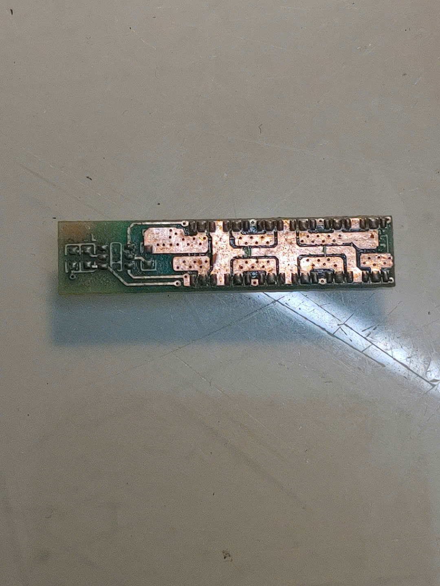 |

### Planned Hardware Changes (Next Round)

- Add a power switching circuit
- Add an STM32 as the main controller
- ESP32 role reduced to network communication only (SIM module interface or Wi-Fi packet sender)

---

## 4. Firmware

- **Environment**: Arduino IDE
- **Target board**: ESP32

### Directory Structure

```
Code/
    iot/
        iot.ino       <- Device 1 firmware
        dashboard.h   <- Inline HTML for AP Mode web dashboard
    iot_2/
        iot_2.ino     <- Device 2 firmware (same code, different access token)
        dashboard.h
```

### Libraries Required

| Library | Purpose |
|---|---|
| `TinyGSM` | SIM A7680C modem communication |
| `PubSubClient` | MQTT client |
| `TinyGPSPlus` | GPS NMEA parsing |
| `DallasTemperature` + `OneWire` | DS18B20 temperature sensor |
| `Adafruit_INA219` | Current/voltage measurement |
| `Adafruit_SSD1306` + `Adafruit_GFX` | OLED display |
| `ArduinoJson` | JSON serialization for MQTT and API |
| `Preferences` | NVS persistent storage |
| `WebServer` | AP Mode HTTP server |

### Configuration

Before flashing, update the following constants in `iot.ino` / `iot_2.ino`:

```cpp
const char* WIFI_SSID = "Your_Wifi_SSID";
const char* WIFI_PASS = "Your_Wifi_Pass";

#define THINGSBOARD_SERVER  "Your_IP_thingsboard_sv"
#define ACCESS_TOKEN        "Your_access_token"   // from ThingsBoard device credentials

#define GSM_APN  "v-internet"  // Viettel APN — change for other carriers
```

### Pin Mapping

| Pin | Function |
|---|---|
| GPIO 27 | Vibration sensor (interrupt) |
| GPIO 4 | DS18B20 temperature (OneWire) |
| GPIO 17 / 16 | GPS RX / TX (Serial1) |
| GPIO 32 / 33 | SIM TX / RX (Serial2) |
| GPIO 21 / 22 | I2C SDA / SCL (OLED + INA219) |

---

## 5. Webserver — ThingsBoard on Raspberry Pi

### Why Local Instead of Cloud

ThingsBoard Cloud charges per data point sent. Running ThingsBoard directly on a Raspberry Pi with an external HDD provides unlimited free storage and ensures data is never lost.

### Installation

Follow the official guide (link saved in `Webserver/how_to_install_thingsboard.txt`):  
https://thingsboard.io/docs/user-guide/install/rpi/

### Importing the Dashboards

After ThingsBoard is running, import the two dashboard JSON files:

| File | Dashboard |
|---|---|
| `iot_-_máy_thi_công_-_demo.json` | Main monitoring dashboard |
| `thống_kê.json` | Statistics dashboard |

### Exposing the Server via ngrok

To make the dashboard accessible from anywhere with an internet connection, ngrok is used to tunnel the local ThingsBoard port to a public URL.

**ngrok command**

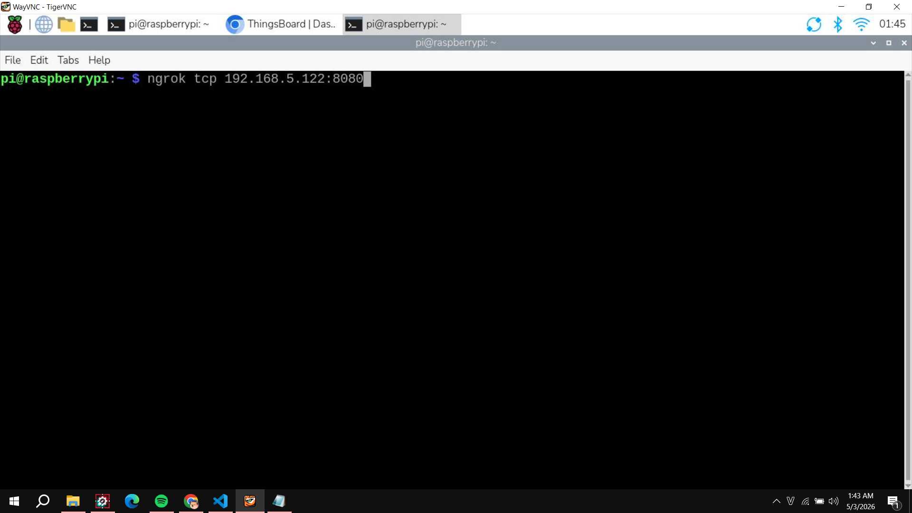

**Public URLs generated by ngrok** (the highlighted address is the link accessible from anywhere)

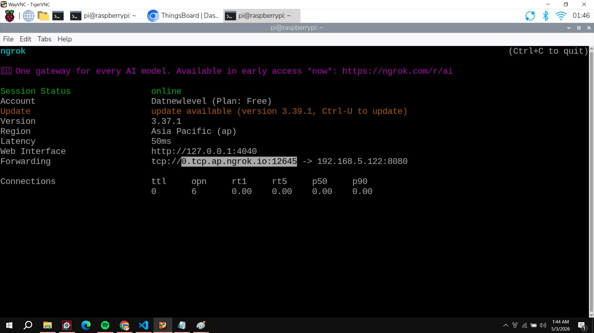 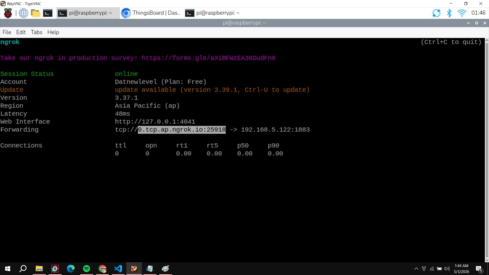

### Dashboard Screenshots

**Login screen** — customer-facing login page used by the team managing the machines.

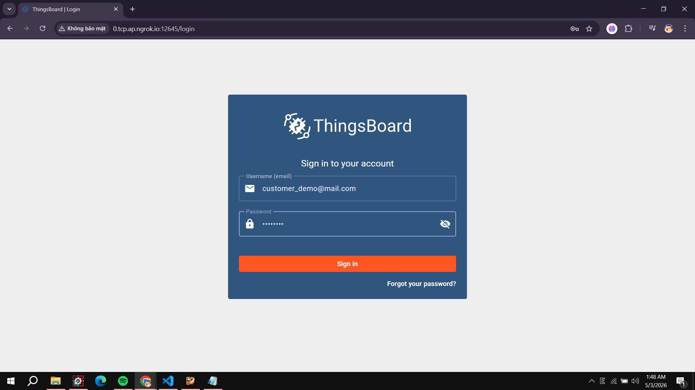

**Dashboard 1** — live map, number of active machines, temperature, operating time, battery percentage.

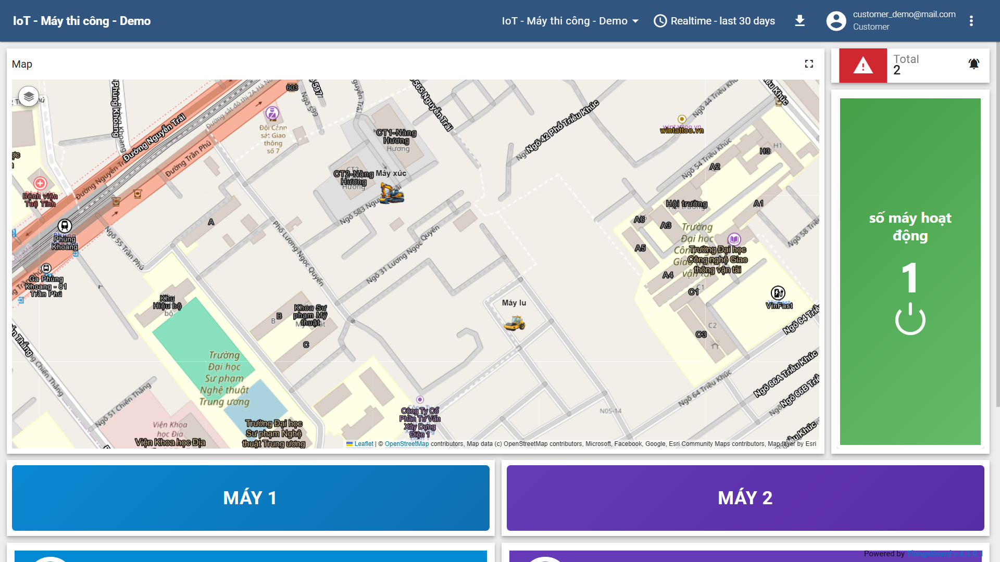

**Dashboard 2** — same overview from a different view.

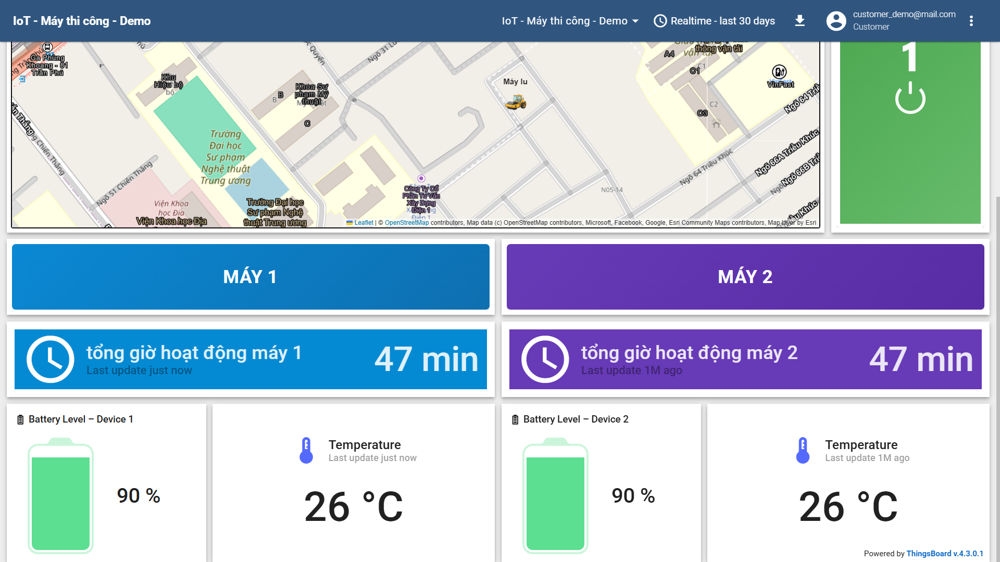

**Dashboard 3** — left: temperature and operating time charts; right: route map over a selected time range (last week, last two weeks, etc.).

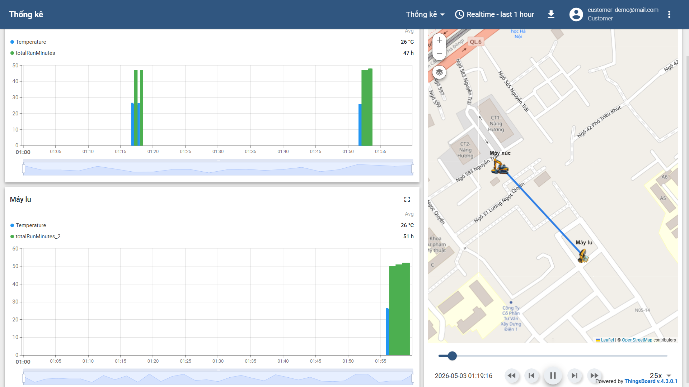
